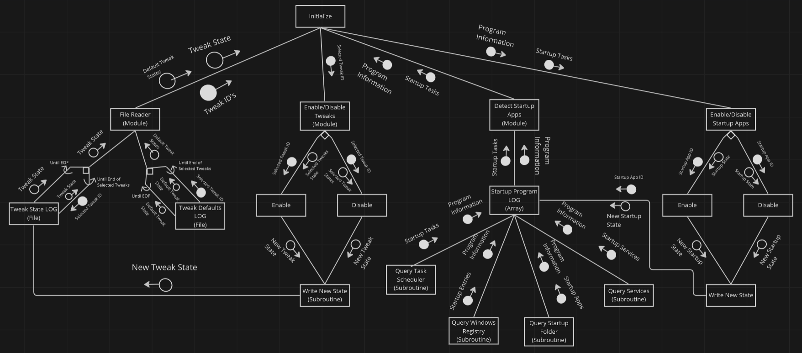
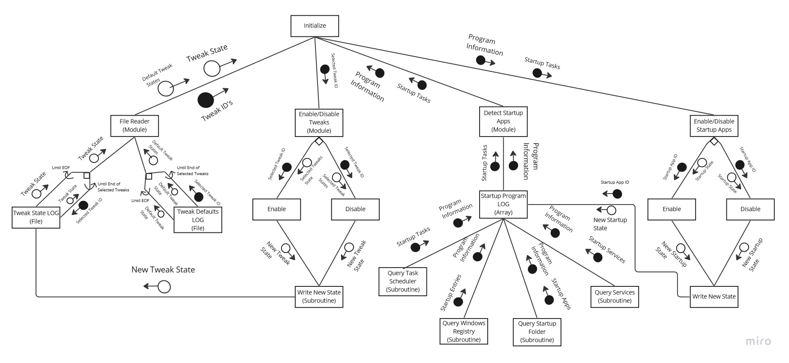

# 📊 2.1 Written description of the program using modelling tools

IPO Diagram &#x26; Structure Chart

* IPO Diagram
* Structure Chart

* **IPO Diagram**

### --> Dashboard ViewModel (Home Page -> Updates, News, Warnings)

| Input                    | Process                                                                                                                                             | Output                                                                        |
| ------------------------ | --------------------------------------------------------------------------------------------------------------------------------------------------- | ----------------------------------------------------------------------------- |
| Menu State               | 
Check if Expanded (Default). Check if Collapsed.
                                                                                          | Apply selected Menu State Value.                                              |
| Selected Navigation Item | 
Retrieve ViewModels list from solutions explorer viewmodels folder. Check if Home Check if Tweaks Check if Startup Check if Docs
 | 
Change Panel ViewModel to Selected Navigating Item. (Changes Pages)
 |

### --> Tweaks ViewModel (Tweaks Page -> Tweaks, Tweak Config)

| Input                                              | Process                                                                                                                                                                               | Output                                                                                                                                         |
| -------------------------------------------------- | ------------------------------------------------------------------------------------------------------------------------------------------------------------------------------------- | ---------------------------------------------------------------------------------------------------------------------------------------------- |
| Selected Tweak ID                                  | 
Check if Enabled. Check if Disabled. Check saved tweak config. Retrieve tweak information. Retrieve tweak config.
                                                  | 
Display Tweak Information to Tweak panel. Display tweak state on tweak status grid. Display saved Tweak config to Tweak panel.
    |
| 
Tweak Enabled Flag Selected Tweak ID 
 | 
Retrieve tweaks registry changes. Apply registry changes. Update Tweak state. Update Tweak State Log file.
                                                            | 
Tweak changes applied. Display Tweak State (enabled) on tweak status grid. 
                                                       |
| 
Tweak Disabled Flag Selected Tweak ID
    | 
Retrieve tweaks registry changes. Rollback tweaks registry changes. Update Tweak state. Update Tweak State Log file.
                                                  | 
Tweak changes Rolledback. Display tweak State (Disabled) on tweak status grid.
                                                       |
| 
Restore Defaults (Singular Tweak)
        | 
Retrieve Default tweak config from Defaults Log file. Retrieve Default tweak State from Defaults Log file. Update Tweak state. Apply Default tweaks registry changes.
 | 
Tweak changes Reset. Display tweak State ([Default]) on tweak status grid. Disable Restore Defaults button for tweak.
             |
| 
Restore Defaults (All Tweaks)
            | 
Retrieve Default tweaks config file. Replace Saved tweak config/state file contents with Default tweak config/state contents.
                                               | 
All Tweak changes Reset. Display tweak States ([Default]) on tweak status grid. Disable Restore Defaults button for page control.
 |

### --> Startup ViewModel (Startup Page -> Startup Apps, Disable/Enable)

| Input                | Process                                                                                                                                               | Output                                                                          |
| -------------------- | ----------------------------------------------------------------------------------------------------------------------------------------------------- | ------------------------------------------------------------------------------- |
| Selected App         | 
Retrieve Program ID from Startup Detect Module. Retrieve Program Information from Startup Detect Module. Retrieve Program Startup State.
 | 
Highlight Startup Entry Row. Update Selected App Value.
               |
| Startup App Enabled  | 
Check startup source from Program Information. Apply Required changes. Update App State. Update Startup State Log file.
               | 
Startup for app Enabled. Displayed App State is updated to Enabled.
   |
| Startup App Disabled | 
Check startup source from Program Information. Apply Required changes. Update App State. Update Startup State Log file.
               | 
Startup for app Disabled. Displayed App State is updated to Disabled.
 |

### --> Settings ViewModel (Settings Page -> User Interface Style)

| Input          | Process                                    | Output                      |
| -------------- | ------------------------------------------ | --------------------------- |
| Selected Theme | 
Check if Dark Check if Light 
 | Apply Selected Theme Value. |

* **structure chart**



<figure><figcaption>
<strong>Structure Chart</strong> is based off the most <mark style="color:red;"><strong>Important Functions</strong></mark> of the solution <strong> </strong><mark style="color:red;"><strong>Performed On Load</strong></mark>
</figcaption></figure>



<figure><figcaption>
<strong>Structure Chart</strong> is based off the most <mark style="color:red;"><strong>Important Functions</strong></mark> of the solution <strong> </strong><mark style="color:red;"><strong>Performed On Load</strong></mark>
</figcaption></figure>



