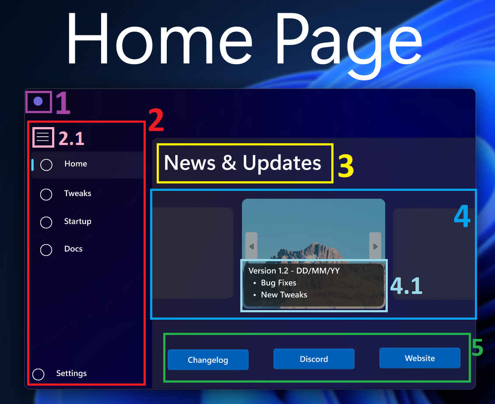
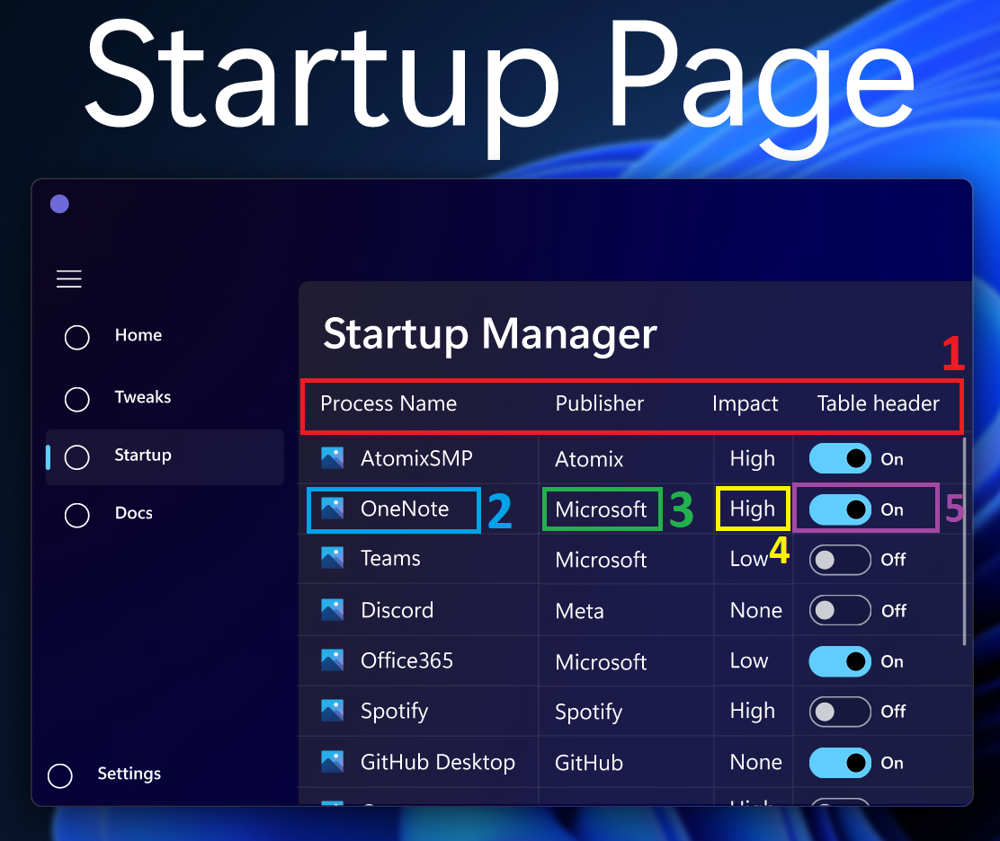
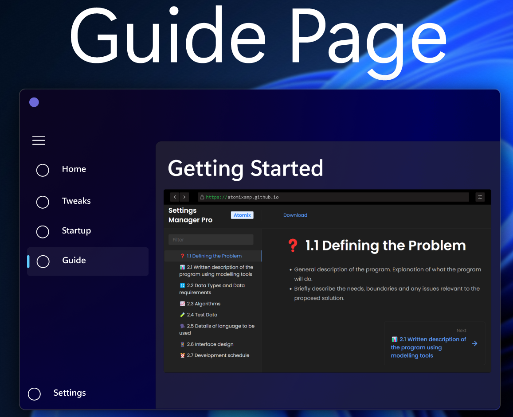

# 📱 2.6 Interface design

Design a draft interface (visual) for your solution including:

* consideration of intended audience
* screen size
* identification of data fields
* screen elements
* online help
* consistency
* current common practice
* awareness of social and ethical issues.



<figure><figcaption></figcaption></figure>


**RAW UN-Annotated version**


* 1 / Purple
  * Application Logo + Title Bar.
* 2 / Red
  * Simple Elegant Navigation Menu allowing for seamless transition between pages.
  * Inspired by the Windows 11 Task Manager NavMenu Design.
* 2.1 / Rose
  * Button to Collapse/Expand the Navigation Menu providing more control over screen usage.
* 3 / Yellow
  * Page Title using Windows 11 Font.
* 4 / Light Blue
  * Revolving carousel of cards with images and buttons.&#x20;
* 4.1 / Light Turquoise&#x20;
  * Information Fly out containing Update Notes/Announcements + Version Number & Date.
* 5 / Green
  * Buttons/Links to external resources including Detailed changelog, Community Support, 1st party resources through official website.



<figure><figcaption></figcaption></figure>


**RAW UN-Annotated version**


* 1 / Red
  * Clean and intuitive category menu for sorting/narrowing down tweaks.
* 2 / Light Blue
  * Tweak List + Status Check Box for easy selection and overview
* 3 / Green
  * Tweak Title + Reset Button - Resets Tweak Config
* 4 / Yellow
  * Tweak Description + Visual Example + Tweak Config Options
* 5 / Purple&#x20;
  * tweak Enable/Disable Toggle inspired by Windows 11 Settings app switches.



<figure><figcaption></figcaption></figure>


**RAW UN-Annotated version**


* 1 / Red
  * Table headers
* 2 / Light Blue
  * Process Name + Icon
* 3 / Green
  * Program Publisher/Company
* 4 / yellow
  * Startup Impact (Performance degradation of Computer post logon)
* &#x20;5 / Purple
  * Startup State Toggle + Status Text Indicator



<figure><figcaption></figcaption></figure>


